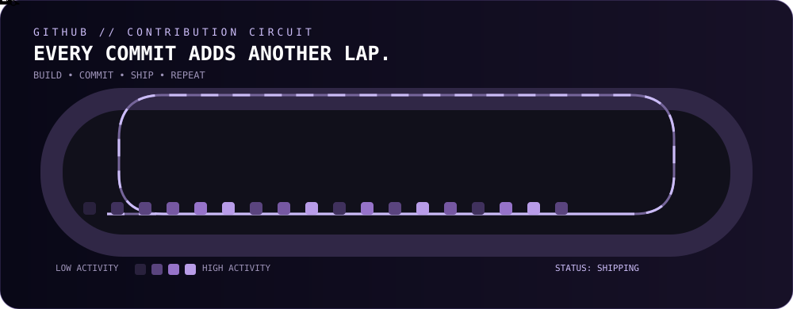

# ADITYA.DEWAN

### Computer Science Engineering Student · Builder · Explorer

Building at the intersection of **Automotive Software, IoT, AI/ML & Cloud**.

<a href="https://linkedin.com/in/aditya-dewan-70739024">LinkedIn</a>
&nbsp;·&nbsp;
<a href="https://github.com/aditya-dewan-cmd">GitHub</a>
&nbsp;·&nbsp;
<a href="mailto:aditya.dewan2005@gmail.com">Email</a>
&nbsp;·&nbsp;
<a href="https://docs.google.com/document/d/1KX3slZoqQOCNIz1XWYG4L5mosJvgtI_H/edit?usp=sharing">Resume</a>

---

---

## 👋 ABOUT ME

I'm **Aditya Dewan**, a Computer Science Engineering student at **Graphic Era Hill University**.

I enjoy building practical systems that combine programming, algorithms, AI/ML, backend development and hardware.

My projects have taken me through:

- 🤖 Artificial Intelligence
- 👁️ Computer Vision
- 🌐 Web & Backend Development
- ☁️ Cloud & Docker
- 📊 Data & Algorithms
- 🏥 Healthcare Technology
- 🔌 IoT & Embedded Systems

> **I don't really have one lane. I have a workshop.**

---

## 🔨 BUILD LOG

### 🦾 [SenseLink](https://github.com/aditya-dewan-cmd/Sense_Link)

**Assistive technology for blind & deaf users**

`AI` `Computer Vision` `YOLOv8` `GPS` `Flask` `ESP32-CAM`

- Object detection
- Voice interaction
- Smart navigation
- Sound detection
- OCR
- SOS with live location
- Accessibility-focused interaction

### 🚗 Cloud-Based Vehicle Simulation

**Vehicle performance simulation & analytics platform**

`Python` `Flask` `REST API` `Docker` `Chart.js`

Simulates:

- Speed
- Fuel consumption
- Acceleration
- Engine temperature
- Road conditions
- Traffic density

### 💊 [PharmaSafe](https://github.com/aditya-dewan-cmd/Pharmasafe)

**Medicine inventory & expiry intelligence**

`Next.js` `React` `Python` `Machine Learning` `SQL`

- Medicine expiry prediction
- FEFO stock prioritization
- Automated alerts
- Inventory analytics
- CSV/PDF reporting

### 🏥 [MedSched](https://github.com/aditya-dewan-cmd/MedSched-Smart-Healthcare)

**Smart healthcare scheduling system**

`Next.js` `TypeScript` `Tailwind CSS`

- Patient queues
- Hospital scheduling
- Resource allocation
- Priority handling
- Deadlock prevention

### 📈 [Stock Market DAA](https://github.com/aditya-dewan-cmd/stock-market-daa)

**Stock market analysis using algorithms**

`Python` `Flask` `Pandas` `Matplotlib`

- Market data analysis
- Greedy trading strategy
- Linear regression
- Data visualization
- Automated reports

---

## 🧰 TECH STACK

**Languages**

`C++` · `Python` · `JavaScript` · `TypeScript`

**Development**

`React` · `Next.js` · `Flask` · `REST APIs`

**AI / Data**

`Machine Learning` · `Computer Vision` · `Pandas` · `Matplotlib`

**Tools**

`Git` · `GitHub` · `Docker` · `NGINX`

**Hardware**

`Arduino` · `ESP32` · `IoT` · `Sensors`

**Foundations**

`DSA` · `OOP` · `Operating Systems`

---

## 🏆 ACHIEVEMENTS & LEARNING

### 🥇 Hack-o-Holic 4.0

Built **SenseLink** in a 24-hour hackathon.

Reached the finale from **200+ registrations**.

### 📡 NPTEL

**Wireless Ad Hoc and Sensor Networks**

**Elite · 85%**

### ☁️ AWS Cloud Essentials

Completed AWS Cloud Essentials training.

### 🤖 AI Foundation Course

**Jio Institute**

### 🎓 Education

**Graphic Era Hill University**

B.Tech — Computer Science Engineering

`2023 — 2027`

---

## 🏎️ GITHUB CONTRIBUTION CIRCUIT

**Every commit adds another lap.**

`BUILD` · `COMMIT` · `SHIP` · `REPEAT`

---

### 🌐 CONNECT

<a href="https://linkedin.com/in/aditya-dewan-70739024">LinkedIn</a>
&nbsp;·&nbsp;
<a href="https://github.com/aditya-dewan-cmd">GitHub</a>
&nbsp;·&nbsp;
<a href="mailto:aditya.dewan2005@gmail.com">Email</a>
&nbsp;·&nbsp;
<a href="https://docs.google.com/document/d/1KX3slZoqQOCNIz1XWYG4L5mosJvgtI_H/edit?usp=sharing">Resume</a>

  

`SYSTEM: ONLINE`

**Still learning. Still building. Still shipping.**

